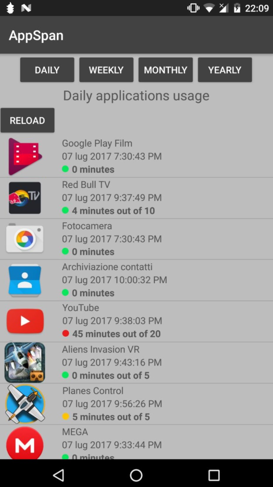
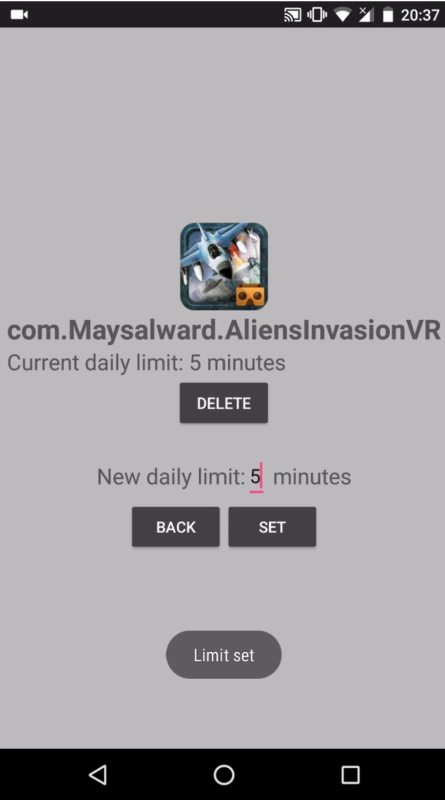

# AppSpanAndroid
AppSpan, an Android App for monitoring applications time usage.
Project for the Mobile Programming Course at Unipd.

Notification:  
  
  
  
App list:  
  
  
  
Set time limit:  
  
